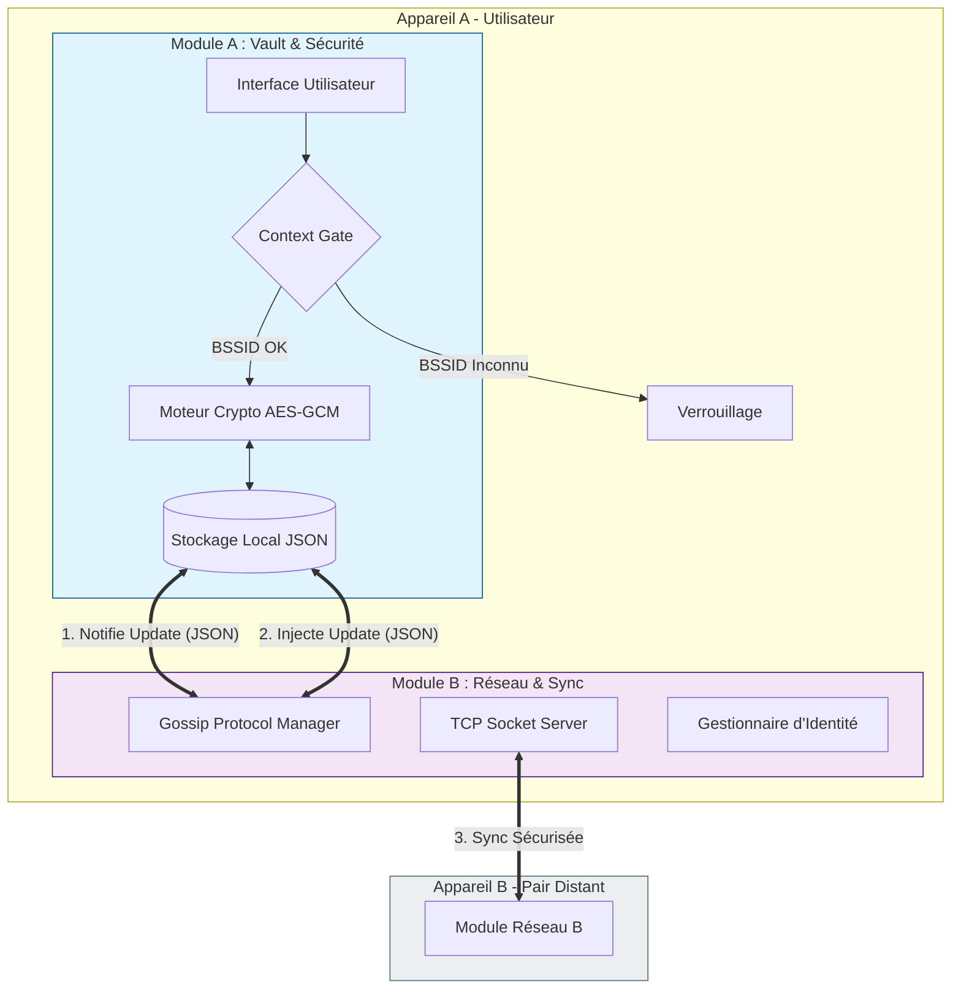
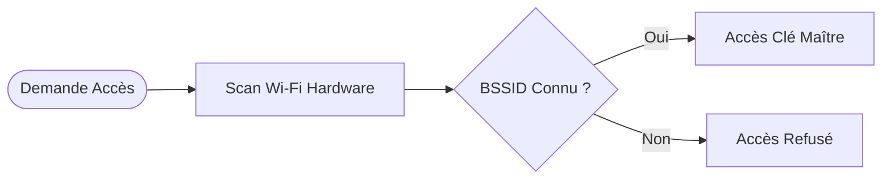
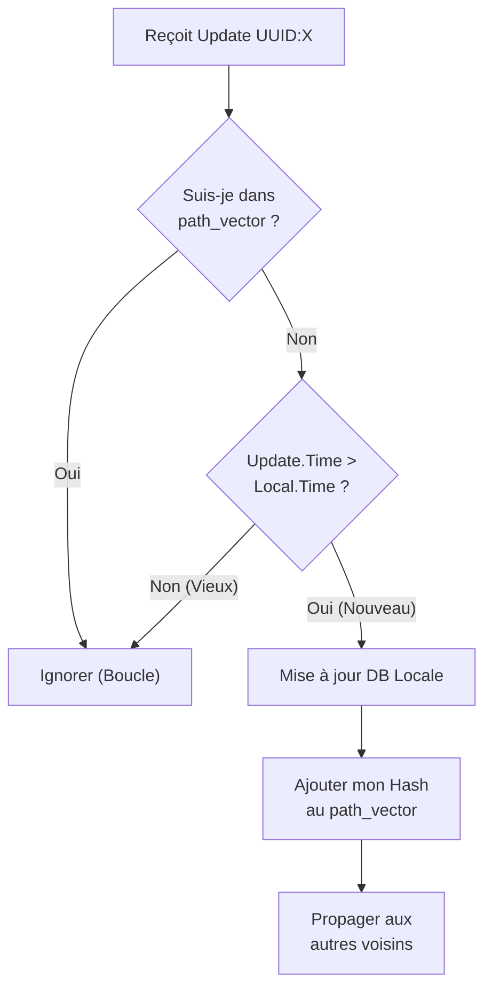
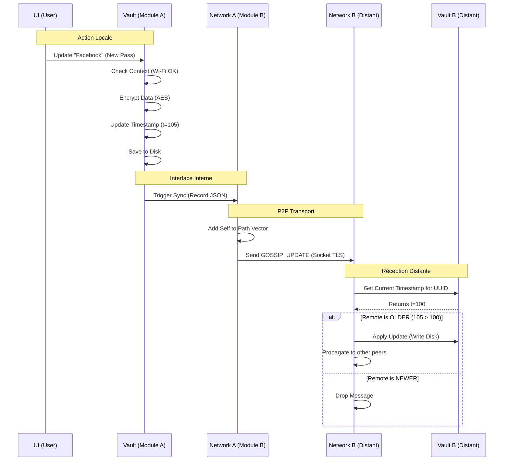

# Spécification Technique : Projet P2P-SafeGuard

## Architecture Décentralisée & Contextuelle pour la Gestion de Mots de Passe
### 1. Vue d'Ensemble & Objectifs

P2P-SafeGuard est un gestionnaire de mots de passe "Zero-Trust" qui élimine le besoin d'un serveur central (Cloud). Il repose sur deux piliers de sécurité :

1. Souveraineté des Données (P2P) : La base de données est répliquée sur chaque appareil via un protocole de synchronisation épidémique (Gossip).
2. Sécurité Contextuelle (Proof of Location) : Le déchiffrement des données est physiquement impossible si l'appareil n'est pas connecté à un réseau Wi-Fi de confiance (BSSID Fingerprinting).

### 2. Architecture Globale

Le système est divisé en deux modules strictement indépendants communiquant via une interface locale.
Extrait de code



### 3. Structure des Données (Le Contrat)

Pour garantir l'indépendance des modules et la rapidité de la synchronisation, nous utilisons une structure de Chiffrement Hybride. Les métadonnées sont en clair (pour le tri), les secrets sont chiffrés.
Format du Fichier `vault.json`
```json

{
  "vault_id": "uuid-v4-unique-vault-id",
  "records": [
    {
      "uuid": "550e8400-e29b-41d4-a716-446655440000",
      "updated_at": 1715082345.5678,  // Timestamp UNIX (Critique pour LWW)
      "is_deleted": false,            // Soft delete pour propagation
      "nonce": "b64_encoded_iv...",   // IV pour AES-GCM
      "ciphertext": "b64_encoded_encrypted_data..." 
    }
  ]
}
```

Contenu du `ciphertext` (une fois déchiffré)

```json
{
  "service": "Google",
  "username": "user@gmail.com",
  "password": "SuperSecretPassword123!",
  "notes": "Compte principal"
}
```

### 4. Module A : Vault & Sécurité (Interne)

Responsabilité : Intégrité des données, chiffrement, validation contextuelle.

#### Feature A.1 : Context Gate (Proof of Location)

Le système vérifie l'environnement physique avant toute opération cryptographique.

- Algorithme :
	1. Récupérer le BSSID (MAC Address du point d'accès Wi-Fi) via commande OS (netsh ou nmcli).
	2. Comparer avec la liste blanche chiffrée (ou hashée) dans config.json.
	3. Si match : Autoriser l'appel à CryptoEngine.
	4. Si non-match : Refuser tout déchiffrement.

Extrait de code


#### Feature A.2 : Moteur Cryptographique

- Algorithme : AES-256 en mode GCM (Galois/Counter Mode).
- Pourquoi GCM ? Il fournit le chiffrement ET l'intégrité. Si la base de données est corrompue ou altérée par un attaquant, le déchiffrement échouera (Authentication Tag verification).
- Clé : Dérivée du Master Password utilisateur via PBKDF2 (SHA-256, 100k itérations).

### 5. Module B : Réseau & Synchronisation (Externe)

**Responsabilité :** Transport, Résolution de conflits, Cohérence éventuelle.

#### Feature B.1 : Gossip Protocol (Propagation)
Pour éviter les boucles infinies dans le réseau P2P, chaque message contient un "Vecteur de Chemin" (Path Vector).

Structure du Paquet Réseau :
```json
{
  "type": "GOSSIP_UPDATE",
  "sender_id": "Device_A",
  "path_vector": ["Hash_Device_A", "Hash_Device_C"], 
  "payload": { ... copie de l'entrée record du vault ... }
}
```

#### Feature B.2 : Résolution de Conflits (LWW)

L'algorithme **Last Write Wins** assure qu'il n'y a qu'une seule vérité basée sur l'horloge.

**Logique de réception d'un message :**

### 6. Scénario de Synchronisation Complète

Voici comment les deux modules interagissent lors d'une modification.

**Scénario : Malo modifie son mot de passe Facebook sur le Device A.**


### 7. Plan de Développement (Répartition)
#### Partie 1 : Core & Storage (Étudiant A)

1. [x] DB Manager : Implémenter la classe Python gérant le chargement/sauvegarde du JSON.
2. [x] Crypto Service : Implémenter AES-GCM avec pycryptodome.
3. [x] Context Checker : Script subprocess pour récupérer le BSSID sous Windows/Linux.
4. [x] Integration : Relier le tout : Si BSSID OK -> Decrypt -> Return JSON.

#### Partie 2 : Network & Logic (Étudiant B)

1. [x] Socket Server : Serveur TCP threadé capable de gérer plusieurs connexions.
2. [x] Peer Discovery : Liste statique d'IPs dans un fichier config pour le PoC (ex: peers: ["192.168.1.15"]).
3. [x] Gossip Logic : Implémenter la fonction handle_message() avec la logique LWW et Path Vector.
4. [x] Integration : Appeler les méthodes du Module A pour lire/écrire les mises à jour reçues.

### 8. Sécurité & Limites (Pour le Rapport)

- Trust Model : On suppose que les pairs autorisés (liste blanche) sont honnêtes (pas de comportement malveillant intentionnel type "Byzantine").
- Horloge : Le système dépend de la synchronisation NTP des horloges système.
- Metadonnées : Un attaquant ayant accès au disque peut voir quand et quel ID a été modifié, mais pas le contenu. C'est un compromis acceptable pour la performance.
