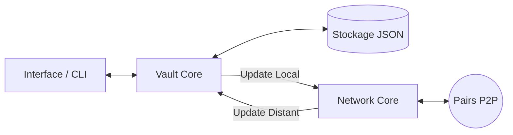

# P2P-SafeGuard

P2P-SafeGuard est un gestionnaire de mots de passe décentralisé ("Zero-Trust") fonctionnant en Peer-to-Peer (P2P). Il élimine le besoin d'un serveur cloud centralisé et garantit que vos secrets ne sont lisibles que dans un environnement physique de confiance.

## 🏗️ Architecture du Projet

Le système est conçu autour d'une séparation stricte des responsabilités entre deux modules qui communiquent via des interfaces locales.

1. **Module Vault (Sécurité & Stockage)** : Gère le chiffrement, le déchiffrement, le stockage sur disque (`vault.json`) et la validation du contexte physique. Il ignore tout du réseau.
2. **Module Sync (Réseau & P2P)** : Gère le serveur TCP, le client TCP, et le protocole épidémique. Il ne connaît ni les clés de chiffrement, ni les données en clair.

### Diagramme de flux de données


## 📖 Documentation de base

### Prérequis
- Python 3.10+
- Dépendance principale : `pycryptodome` (voir `requirements.txt`)
- Docker et Docker Compose (pour les tests d'intégration simulés)

### Lancer l'application localement

1. Créez (ou modifiez) le fichier `config.json` à la racine :
```json
{
  "node_id": "Mon_Device_1",
  "host": "0.0.0.0",
  "port": 5000,
  "peers": [{"ip": "192.168.1.15", "port": 5000}],
  "allowed_bssids_hashes": ["votre_hash_bssid_autorise"]
}
```

2. Installez les dépendances et lancez le programme :
```bash
pip install -r requirements.txt
python main.py
```
Un CLI interactif s'ouvrira pour ajouter/lire vos secrets si votre Wi-Fi correspond au BSSID autorisé.

### Lancer le cluster de test (Docker)
Un cluster simulé de 3 nœuds en anneau est fourni pour tester la résilience P2P et la résolution de conflits.
```bash
docker compose up -d --build
# Injecter une fausse donnée sur le noeud 1 pour tester la propagation :
python tests/scripts/test_gossip.py
```

## 🧠 Algorithmes employés & Justifications

### 1. Proof of Location (BSSID Fingerprinting)
- **Pourquoi ?** P2P-SafeGuard ajoute une couche de sécurité contextuelle. Si votre disque dur est dérobé ou si votre ordinateur portable est ouvert dans un lieu public, l'application refusera de déchiffrer vos données.
- **Comment ?** En récupérant l'adresse MAC (BSSID) du routeur Wi-Fi auquel vous êtes connecté. Seuls les routeurs dont le hash est présent dans `config.json` permettent l'activation du moteur cryptographique.

### 2. Chiffrement AES-256-GCM & Dérivation PBKDF2
- **Pourquoi GCM ?** Le mode Galois/Counter Mode (GCM) fournit un "Authentication Tag". Contrairement au mode CBC classique, GCM empêche et détecte toute altération du fichier `.json`. Si un attaquant modifie un caractère du fichier chiffré, le déchiffrement échouera proprement.
- **Pourquoi PBKDF2 ?** Pour dériver de manière sécurisée une clé robuste de 256 bits à partir de votre mot de passe maître en utilisant 100 000 itérations, ce qui ralentit considérablement les attaques par force brute.

### 3. Protocole Gossip avec Path Vector
- **Pourquoi ?** Pour distribuer rapidement et sans serveur central (P2P) les données à l'ensemble des appareils.
- **Comment (Path Vector) ?** Chaque message P2P intègre une liste des nœuds qu'il a déjà traversés. Si un nœud reçoit un message où son propre identifiant figure déjà dans le vecteur, il jette le message. *Justification : Cela évite les tempêtes de broadcast (boucles infinies) inhérentes aux topologies réseau décentralisées fermées.*

### 4. Résolution de conflit LWW (Last Write Wins)
- **Pourquoi ?** Dans un système distribué asynchrone, deux nœuds peuvent modifier la même donnée. Il faut un consensus sans serveur centralisateur (pas de base SQL centrale).
- **Comment ?** Chaque enregistrement dispose d'un `updated_at` (Timestamp UNIX). Lorsqu'un nœud reçoit une modification du réseau, il compare le Timestamp réseau avec son Timestamp local. Si la version réseau est strictement supérieure, il écrase sa donnée locale et propage le message. Sinon, il ignore silencieusement la donnée obsolète.
