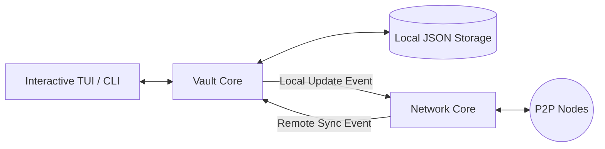

# 🛡️ P2P-SafeGuard

**P2P-SafeGuard** is a decentralized, Zero-Trust password manager operating over a Peer-to-Peer (P2P) network. 
It eliminates the need for any centralized cloud server and guarantees that your secrets are only readable within a trusted physical environment.

## ✨ Key Features

- **No Central Server**: Total synchronization across your devices via a custom P2P Gossip Protocol.
- **Context-Aware Security (Proof of Location)**: Encryption keys unlock *only* if the device is connected to an authorized Wi-Fi network (BSSID fingerprinting).
- **Advanced Cryptography**: Uses `AES-256-GCM` for authenticated encryption and `PBKDF2-HMAC-SHA256` for strong key derivation.
- **Conflict Resolution (LWW)**: Automatic "Last Write Wins" logic to prevent data loss during concurrent offline edits.
- **Seamless TUI**: An interactive, modern Terminal User Interface for daily secret management.

---

## 🏗️ Project Architecture

The system is designed around a strict separation of concerns, divided into two independent modules:

1. **Vault Module (Security & Storage)**: Handles encryption, decryption, disk storage (`vault.json`), and physical context validation. It is entirely unaware of the network.
2. **Sync Module (Network & P2P)**: Handles the TCP server, TCP client, and the epidemic protocol. It never sees plain-text data or encryption keys.

### Data Flow Diagram


---

## 🚀 Getting Started (Local Usage)

### Prerequisites
- Python 3.10+
- `pycryptodome` and TUI libraries (see `requirements.txt`)
- Linux OS (for default `iwgetid` BSSID gathering)

### Installation

1. Clone the repository and install dependencies:
```bash
python -m venv venv
source venv/bin/activate
pip install -r requirements.txt
```

2. Create or modify the `config.json` file at the root of the project:
```json
{
  "node_id": "My_Personal_Laptop",
  "host": "0.0.0.0",
  "port": 5000,
  "peers": [{"ip": "192.168.1.15", "port": 5000}],
  "allowed_bssids_hashes": ["e551de0..."]  // SHA-256 hash of your Home router MAC address
}
```

3. Launch the Application:
```bash
make cli
```
An interactive terminal window will open to initialize your Master Password and manage your secrets.

---

## 🧪 Testing and Docker Cluster

P2P-SafeGuard comes with an automated testing suite and a fully configured **3-Node Docker Cluster** to experiment with the synchronization and conflict resolution safely.

### Available Makefile Commands

| Command | Description |
|---|---|
| `make cli` | Runs the interactive Python script on your host machine. |
| `make test-unit` | Runs the unit test suite inside a blank Docker container (Tests Crypto, Gossip, and CRUD Logic). |
| `make test-func` | Runs functional tests inside a Docker container (Tests Vault initialization, reset, and login denial). |
| `make test-all` | Chains all validation tests. |
| `make docker-up` | Builds and starts the 3-Node P2P simulation cluster in the background. |
| `make docker-exec n=X` | **[Very useful]** Attaches an interactive terminal to a specific node (where X is 1, 2, or 3) to test synchronization live. |
| `make docker-down` | Stops and gracefully removes the simulation containers. |
| `make clean` | Deletes all local `vault*.json` files. |

> [!TIP]
> **Testing Synchronization Life**: Run `make docker-up`, then open two terminals. In the first one, type `make docker-exec n=1` and add a secret. In the second one, type `make docker-exec n=2`, list the secrets, and watch your data instantly appear from the network!

---

## 🧠 Algorithms & Technical Justifications

### 1. Proof of Location (BSSID Fingerprinting)
- **Why?** P2P-SafeGuard adds a contextual security layer. If your hard drive is stolen or your laptop is booted in a public place, the application will forcefully refuse to decrypt your data.
- **How?** By reading the current MAC address (BSSID) of the connected Wi-Fi router. Only routers whose hash matches the `allowed_bssids_hashes` list in `config.json` will allow the cryptographic engine to start.

### 2. Encryption: AES-256-GCM & PBKDF2
- **Why GCM?** Galois/Counter Mode (GCM) provides an "Authentication Tag". Unlike standard CBC mode, GCM explicitly prevents and detects file modifications. If an attacker tampers with a single byte of your `vault.json`, the decryption fails immediately.
- **Why PBKDF2?** To securely derive a 256-bit key from your human Master Password using 100,000 algorithmic iterations, considerably slowing down brute-force attacks.

### 3. Gossip Protocol with Path Vector
- **Why?** To distribute data quickly inside a P2P network without any central server.
- **How?** Every P2P broadcast embeds a list of all node IDs it has already visited. If a node receives a message and sees its own ID in the "Path Vector", it drops the package. *This prevents infinite broadcast storms.*

### 4. Conflict Resolution (Last Write Wins - LWW)
- **Why?** In an asynchronous distributed network, two nodes could modify the same password while briefly disconnected.
- **How?** Every record has an `updated_at` UNIX Timestamp. When a node receives an update from the network, it compares the packet's timestamp with its local database. If the network version is strictly newer, the local data is overwritten and propagated. If the local data is newer, the old network packet is silently ignored.
